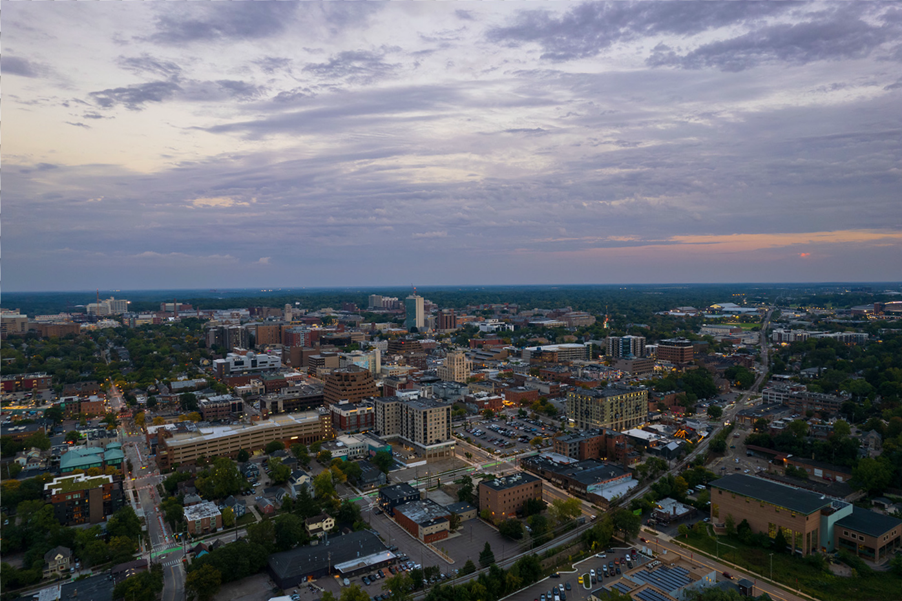

# splitter

This is a simple tool to take a scanned document with multiple physical images, detect each photo, segment, straighten and then split them into independent files.

It can handle any number of non overlapping rectangular images with different sizes and orientations.

This tool was made to speed up the scanning of old family photos.

Keep in mind, it is not a production grade tool and isn't really meant to be used for anything professional.

## Example

We have the following scan file with 3 photos:


We run the following command:

```bash
$ splitter docs/combined-test.jpg 20 # 20 is the background detection threshold, you can adjust if your scanner sucks or the image edges are brighter
Found 3 objects in 1.289650917s
Finished object 0 in 99.093792ms
Finished object 1 in 134.498875ms
Finished object 2 in 128.337666ms
```

The tool processes the images, detecting, segmenting, and rotating them like the following.
Green indicates the background pixels, red lines are the bounding box, blue lines are the detected edges (the algorithm used here is atypical), and orange overlay is the pixels used for interpolation (currently bilinear) to straighten the image:
:


Then we get three files with the extracted images:



